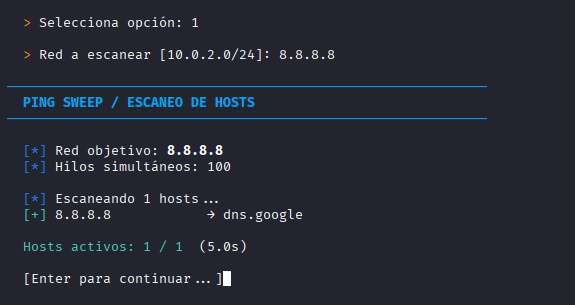
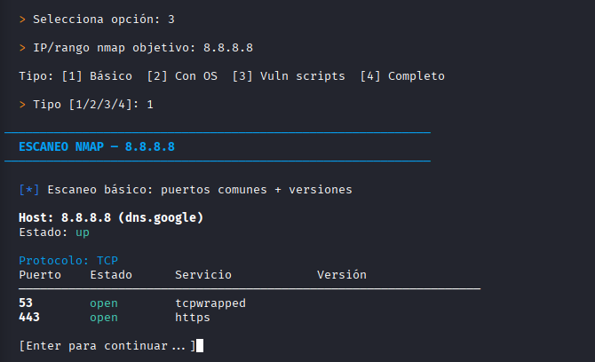
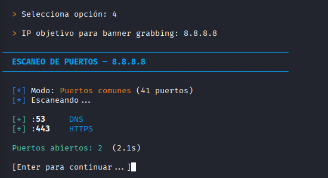
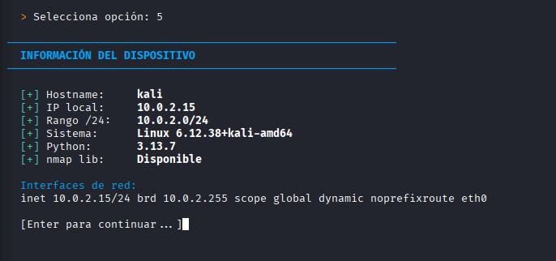
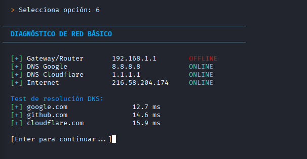
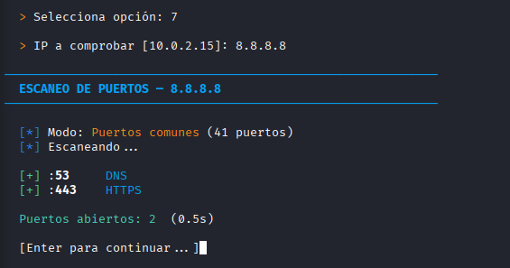
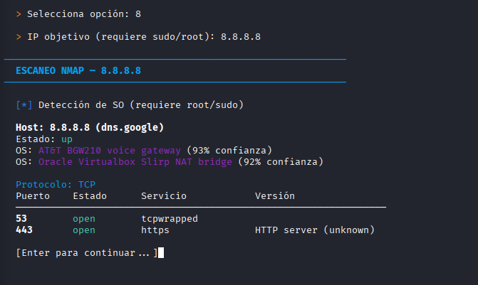
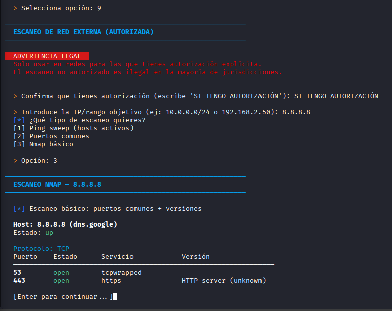

##  Menu principal


[README.txt](https://github.com/user-attachments/files/28145783/README.txt)
#  NetScanner

Herramienta de análisis de red desarrollada en Python para entornos de laboratorio y redes autorizadas.

---

##  Características

- Escaneo de hosts activos (Ping Sweep)
- Escaneo de puertos TCP
- Banner Grabbing
- Integración con Nmap
- Detección de sistema operativo
- Diagnóstico básico de red
- Exportación de resultados (JSON/TXT)
- Historial de escaneos

---

##  Requisitos

- Python 3.x
- nmap instalado en el sistema (opcional)
- Librería python-nmap (opcional)

Instalación:

```bash
pip install python-nmap

En Linux:

sudo apt install nmap


Uso

Ejecutar el programa:

python3 netscanner.py
  Menú principal
1 → Escaneo de hosts (ping sweep)
2 → Escaneo de puertos TCP
3 → Escaneo con Nmap
4 → Captura de banners
5 → Información del sistema
6 → Diagnóstico de red
7 → Puertos comunes
8 → Detección de sistema operativo
9 → Escaneo de red externa autorizada
H → Historial
E → Exportar resultados
Q → Salir

```
## Funcionalidades principales

NetScanner incorpora diferentes funcionalidades orientadas a la auditoría básica de redes y análisis de sistemas en entornos Linux:
## 1. Escaneo de hosts (Ping Sweep)

Permite detectar dispositivos activos dentro de una red local.



---

## 2. Escaneo de puertos TCP

Analiza los puertos abiertos de un host objetivo utilizando sockets TCP.


---

## 3. Escaneo con Nmap

Ejecuta escaneos avanzados mediante integración con Nmap.



---

## 4. Captura de banners de servicios

Obtiene información básica de los servicios detectados.



---

## 5. Información del sistema

Muestra información básica del sistema y entorno de ejecución.



---

## 6. Diagnóstico básico de red

Permite comprobar conectividad y estado básico de red.



---

## 7. Escaneo de puertos comunes

Realiza análisis rápido sobre puertos habituales.



---

## 8. Detección de sistema operativo

Utiliza Nmap para detectar el sistema operativo del host objetivo.



---

## 9. Escaneo de red objetivo

Permite realizar análisis completos sobre una IP o red específica.




Estas funcionalidades permiten automatizar tareas básicas de reconocimiento y análisis de red desde una única interfaz CLI sencilla y organizada.

Aviso legal

Esta herramienta debe utilizarse únicamente en redes propias o con autorización explícita. El uso no autorizado puede ser ilegal.

Autor
GitHub: https://github.com/soulstep29
